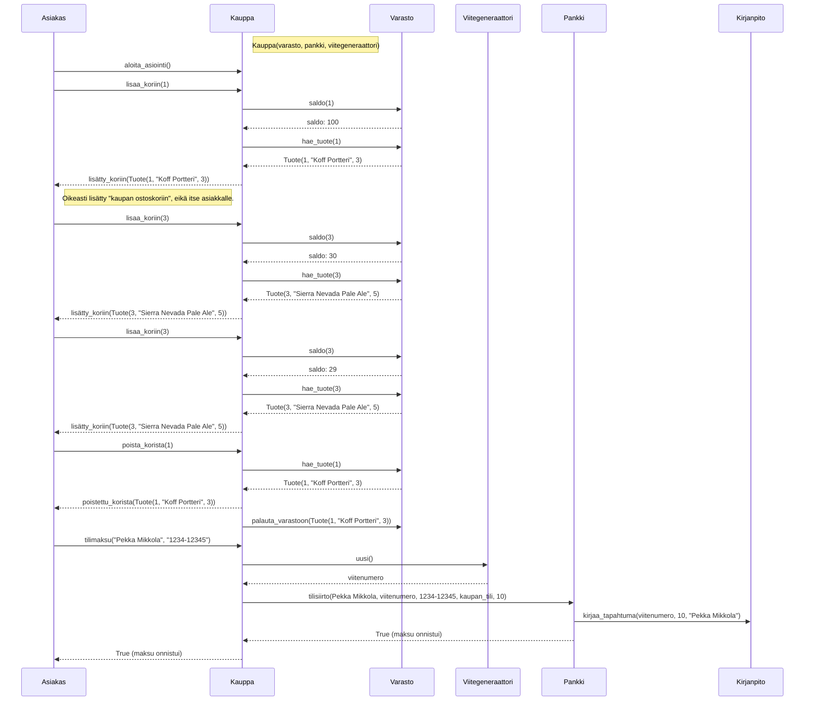

# Ensimmäisen ostostapahtuman sekvenssikaavio

```mermaid
sequenceDiagram
  participant Asiakas
  participant Kauppa
  participant Varasto
  participant Viite as Viitegeneraattori
  participant Pankki
  participant Kirjanpito

  Note right of Kauppa: Kauppa(varasto, pankki, viitegeneraattori)
  Asiakas->>Kauppa: aloita_asiointi()

  %% Tuotteen 1 lisääminen koriin
  Asiakas->>Kauppa: lisaa_koriin(1)
  Kauppa->>Varasto: saldo(1)
  Varasto-->>Kauppa: saldo: 100
  Kauppa->>Varasto: hae_tuote(1)
  Varasto-->>Kauppa: Tuote(1, "Koff Portteri", 3)
  Kauppa-->>Asiakas: lisätty_koriin(Tuote(1, "Koff Portteri", 3))
  Note left of Kauppa: Oikeasti lisätty "kaupan ostoskoriin", eikä itse asiakkalle.

  %% Tuotteen 3 lisääminen koriin
  Asiakas->>Kauppa: lisaa_koriin(3)
  Kauppa->>Varasto: saldo(3)
  Varasto-->>Kauppa: saldo: 30
  Kauppa->>Varasto: hae_tuote(3)
  Varasto-->>Kauppa: Tuote(3, "Sierra Nevada Pale Ale", 5)
  Kauppa-->>Asiakas: lisätty_koriin(Tuote(3, "Sierra Nevada Pale Ale", 5))

  %% Tuotteen 3 lisääminen koriin uudestaan
  Asiakas->>Kauppa: lisaa_koriin(3)
  Kauppa->>Varasto: saldo(3)
  Varasto-->>Kauppa: saldo: 29
  Kauppa->>Varasto: hae_tuote(3)
  Varasto-->>Kauppa: Tuote(3, "Sierra Nevada Pale Ale", 5)
  Kauppa-->>Asiakas: lisätty_koriin(Tuote(3, "Sierra Nevada Pale Ale", 5))

  %% Tuotteen 1 poistaminen korista
  Asiakas->>Kauppa: poista_korista(1)
  Kauppa->>Varasto: hae_tuote(1)
  Varasto-->>Kauppa: Tuote(1, "Koff Portteri", 3)
  Kauppa-->>Asiakas: poistettu_korista(Tuote(1, "Koff Portteri", 3))
  Kauppa->>Varasto: palauta_varastoon(Tuote(1, "Koff Portteri", 3))

  %% Maksutapahtuma
  Asiakas->>Kauppa: tilimaksu("Pekka Mikkola", "1234-12345")
  Kauppa->>Viite: uusi()
  Viite-->>Kauppa: viitenumero
  Kauppa->>Pankki: tilisiirto(Pekka Mikkola, viitenumero, 1234-12345, kaupan_tili, 10)
  Pankki->>Kirjanpito: kirjaa_tapahtuma(viitenumero, 10, "Pekka Mikkola")
  Pankki-->>Kauppa: True (maksu onnistui)
  Kauppa-->>Asiakas: True (maksu onnistui)

```
